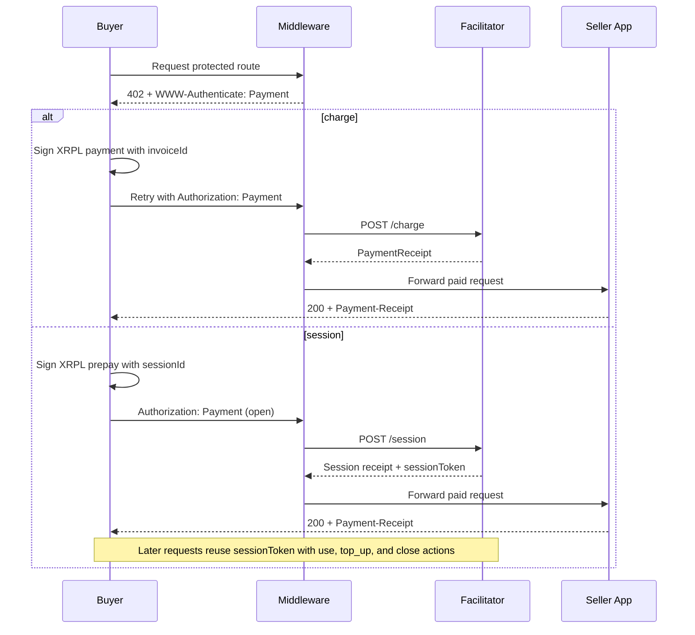

# xrpl-mpp-stack

[](https://lgcarrier.github.io/xrpl-mpp-stack/)

Python-first XRPL infrastructure for MPP HTTP payments.

Hosted docs: <https://lgcarrier.github.io/xrpl-mpp-stack/>

Upstream MPP protocol specs: <https://github.com/tempoxyz/mpp-specs>

This repo migrates the original XRPL x402 stack onto the MPP HTTP model:

- `xrpl-mpp-core`: shared MPP models, header codecs, challenge helpers, and XRPL asset utilities
- `xrpl-mpp-facilitator`: FastAPI facilitator for XRPL `charge` and `session`
- `xrpl-mpp-middleware`: ASGI middleware that emits `WWW-Authenticate: Payment` and verifies `Authorization: Payment`
- `xrpl-mpp-client`: HTTPX transport and signer for XRPL-backed MPP retries
- `xrpl-mpp-payer`: CLI, proxy, and MCP payer runtime

## Package chooser

Pick the package for the role you are building. Most integrators start with
`xrpl-mpp-middleware` on the seller side or `xrpl-mpp-client` on the buyer side,
then add `xrpl-mpp-facilitator` as the settlement service.

| Package | PyPI | Install | Use when |
| --- | --- | --- | --- |
| [Core](docs/packages/core.md) | [](https://pypi.org/project/xrpl-mpp-core/) | `pip install xrpl-mpp-core` | You need the shared MPP models, codecs, and XRPL asset helpers directly. |
| [Facilitator](docs/packages/facilitator.md) | [](https://pypi.org/project/xrpl-mpp-facilitator/) | `pip install xrpl-mpp-facilitator` | You are running the FastAPI settlement service behind protected seller routes. |
| [Middleware](docs/packages/middleware.md) | [](https://pypi.org/project/xrpl-mpp-middleware/) | `pip install xrpl-mpp-middleware` | You are protecting ASGI or FastAPI routes that should return `402` until paid. |
| [Client](docs/packages/client.md) | [](https://pypi.org/project/xrpl-mpp-client/) | `pip install xrpl-mpp-client` | You are building a buyer that signs XRPL payments and retries MPP challenges automatically. |
| [Payer](docs/packages/payer.md) | [](https://pypi.org/project/xrpl-mpp-payer/) | `pip install xrpl-mpp-payer` | You want a turnkey buyer CLI, local proxy, receipts, or MCP support for agents. |

For the smallest application-level references, start with
`examples/seller_minimal.py` and `examples/buyer_minimal.py`. The fuller local
demo stack remains `examples/merchant_fastapi/app.py`, `examples/buyer_httpx.py`,
and `docker compose`.

## Supported intents

- `charge`: one request, one XRPL payment
- `session`: prepaid XRPL session with `open`, `use`, `top_up`, and `close`

## Payment flow at a glance



## HTTP wire contract

- `402` responses return one or more `WWW-Authenticate: Payment ...` headers
- paid retries use `Authorization: Payment <base64url-jcs-credential>`
- successful paid responses include `Payment-Receipt: <base64url-jcs-receipt>`
- auth-scheme matching for `WWW-Authenticate` and `Authorization` is case-insensitive; docs use canonical `Payment`
- `402` responses use `Cache-Control: no-store`
- successful paid responses use `Cache-Control: private`

Seller-side `PaymentMiddlewareASGI` now rejects protected-route request bodies larger than `32768` bytes by default. Override that ceiling with `PaymentMiddlewareASGI(..., max_request_body_bytes=...)` when needed.

## Minimal app examples

Run the smallest seller example:

```bash
uvicorn examples.seller_minimal:app --reload --port 8010
```

Run the matching buyer example:

```bash
XRPL_WALLET_SEED=replace-with-testnet-seed \
XRPL_RPC_URL=https://s.altnet.rippletest.net:51234/ \
TARGET_BASE_URL=http://127.0.0.1:8010 \
python -m examples.buyer_minimal
```

## Local demo

```bash
cp .env.example .env
docker compose up --build facilitator merchant
python -m examples.buyer_httpx
```

`.env.example` is a template. Before you run the demo, fill in `MY_DESTINATION_ADDRESS`, `FACILITATOR_BEARER_TOKEN`, `MPP_CHALLENGE_SECRET`, and `XRPL_WALLET_SEED`, then switch `NETWORK_ID`, `XRPL_NETWORK`, and `XRPL_RPC_URL` to XRPL Testnet values such as `xrpl:1` and `https://s.altnet.rippletest.net:51234`.

`docker compose` passes that same `.env` file into the facilitator and merchant containers, and `python -m examples.buyer_httpx` now auto-loads `.env` from the repo root for local runs.

The merchant example protects `GET /premium` with MPP `charge`. The buyer example signs the XRPL payment, retries automatically, and prints the unlocked response.

## CLI

```bash
xrpl-mpp pay https://merchant.example/premium --amount 0.001 --asset XRP --dry-run
xrpl-mpp proxy https://merchant.example --port 8787
xrpl-mpp mcp
```

## Development Setup

Install the whole monorepo for local development:

```bash
python3.12 -m venv .venv
. .venv/bin/activate
python -m pip install -r requirements-dev.txt
```

`requirements-dev.txt` installs all five packages in editable mode:

- `-e ./packages/core`
- `-e ./packages/facilitator`
- `-e ./packages/middleware`
- `-e ./packages/client`
- `-e ./packages/payer`

If you only want one package, install it directly from its package folder:

```bash
python -m pip install -e ./packages/core
python -m pip install -e ./packages/facilitator
python -m pip install -e ./packages/middleware
python -m pip install -e ./packages/client
python -m pip install -e ./packages/payer
```

The package directory names are `core`, `facilitator`, `middleware`, `client`,
and `payer`, while the published package names are `xrpl-mpp-core`,
`xrpl-mpp-facilitator`, `xrpl-mpp-middleware`, `xrpl-mpp-client`, and
`xrpl-mpp-payer`.

## Verification

Focused migration coverage currently lives in the MPP-native test set:

```bash
python3.12 -m venv .venv
. .venv/bin/activate
python -m pip install -r requirements-dev.txt
python -m pytest -q \
  tests/test_mpp_http.py \
  tests/test_stack_package_exports.py \
  tests/test_xrpl_mpp_package.py \
  tests/test_xrpl_mpp_client.py \
  tests/test_xrpl_mpp_middleware.py \
  tests/test_xrpl_mpp_payer.py \
  tests/test_xrpl_mpp_local_integration.py \
  tests/test_examples.py
```
