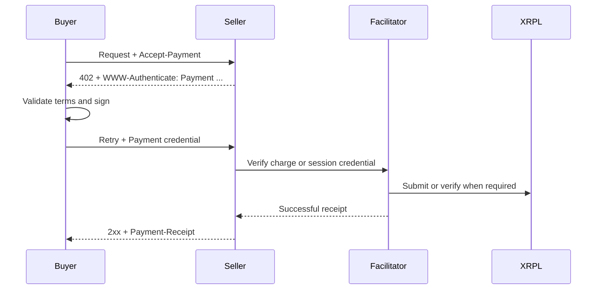

# xrpl-mpp-stack

[](https://lgcarrier.github.io/xrpl-mpp-stack/)

Python 3.12 infrastructure for Machine Payments Protocol (MPP) payments on the
XRP Ledger. Version 0.2 is a clean break from this repository's earlier
prepaid-session protocol and follows the current MPP HTTP contracts plus the
XRPL method used by Ripple's reference SDK.

- Hosted documentation: <https://lgcarrier.github.io/xrpl-mpp-stack/>
- Normative MPP drafts: <https://github.com/tempoxyz/mpp-specs>
- Ripple XRPL reference SDK: <https://github.com/ripple/xrpl-mpp-sdk>

## Standards boundary

The stack deliberately separates protocol requirements from implementation
choices:

- **MPP HTTP core:** `402` challenges in `WWW-Authenticate`, credentials in
  `Authorization: Payment` or the challenge-selected `Payment-Authorization`
  field, optional `Accept-Payment` preferences, and `Payment-Receipt` on a
  successful paid response.
- **XRPL profile:** one-time `charge` payments accept a signed transaction blob
  (pull mode) or a submitted transaction hash (push mode). Networks are named
  `mainnet`, `testnet`, or `devnet`; currencies use `XRP` or the XRPL JSON
  descriptor form.
- **XRPL Payment Channels:** `session` uses signed cumulative claims with
  `open`, `voucher`, and `close` actions. A voucher must advance the stored
  high-water mark. `close` is a final voucher, not an on-ledger refund or
  channel deletion. `PaymentChannelFund` remains an out-of-band XRPL operation.
  There are no reusable session tokens, `use` actions, or application-level
  top-ups in 0.2.
- **Discovery draft-01:** OpenAPI discovery advertises `charge` and `session`
  offers. Runtime `402` challenges remain authoritative.
- **MCP transport:** `xrpl-mpp-mcp` carries challenges, credentials, receipts,
  capabilities, and exact payment errors in MCP/JSON-RPC `_meta`. This is
  independent of the payer package's optional MCP server.
- **Subscription:** the upstream generic subscription intent exists, but there
  is no XRPL subscription method profile in this stack. XRPL subscription
  settlement is therefore unsupported.
- **Hooks and relay:** lifecycle hooks and the sanitized outcome relay are
  optional application architecture, not MPP wire-protocol requirements.

## Packages

| Package | Role |
| --- | --- |
| [`xrpl-mpp-core`](docs/packages/core.md) | MPP HTTP models/codecs, RFC 8785 canonicalization, XRPL charge and PayChannel contracts |
| [`xrpl-mpp-facilitator`](docs/packages/facilitator.md) | Authenticated FastAPI verifier/settler with Redis replay and channel state |
| [`xrpl-mpp-middleware`](docs/packages/middleware.md) | Seller-side ASGI challenges, facilitator verification, discovery helpers, hooks, and relay |
| [`xrpl-mpp-client`](docs/packages/client.md) | Buyer-side signing and one-retry `httpx` transport for charge and PayChannel flows |
| [`xrpl-mpp-payer`](docs/packages/payer.md) | Operator CLI, proxy, receipt store, spend policy, and optional agent server |
| [`xrpl-mpp-mcp`](packages/mcp/README.md) | Framework-neutral native MPP transport for paid MCP operations |

## HTTP exchange


```mermaid
sequenceDiagram
    participant Buyer
    participant Seller
    participant Facilitator
    participant XRPL

    Buyer->>Seller: Request + Accept-Payment
    Seller-->>Buyer: 402 + WWW-Authenticate: Payment ...
    Buyer->>Buyer: Validate terms and sign
    Buyer->>Seller: Retry + Payment credential
    Seller->>Facilitator: Verify charge or session credential
    Facilitator->>XRPL: Submit or verify when required
    Facilitator-->>Seller: Successful receipt
    Seller-->>Buyer: 2xx + Payment-Receipt
```

The buyer sends at most one automatic paid retry. A credential is bound to the
original challenge, request digest when present, XRPL network, recipient,
currency, amount, and payer source. A receipt is emitted only when the paid
application response succeeds.

## Development setup

```bash
python3.12 -m venv .venv
. .venv/bin/activate
python -m pip install -r requirements-dev.txt
pytest
```

The editable development install includes all six packages. The Compose
development profile starts Redis, the facilitator, and the merchant example:

```bash
cp .env.example .env
docker compose up --build redis facilitator merchant
```

With Testnet wallet values filled in, run the trace buyer separately:

```bash
docker compose --profile demo run --rm buyer
```

Compose explicitly opts the merchant into unencrypted HTTP for its private
development-only hop to `facilitator:8000`. The standalone seller examples
permit unencrypted facilitator traffic only to a literal localhost or loopback
address. Use TLS for every remote or production facilitator origin.

Use XRPL Testnet credentials and endpoints for development. The live integration
test is intentionally opt-in:

```bash
RUN_XRPL_TESTNET_LIVE=1 pytest -m live tests/integration/test_live_testnet.py -s
```

## Fund an RLUSD Testnet wallet

Create a fresh wallet, request XRP from the Testnet faucet, and acquire enough
official Testnet RLUSD to reach an exact target balance without connecting a
browser wallet:

```bash
python -m devtools.rlusd_fund \
  --new-wallet \
  --target-rlusd 10 \
  --max-xrp 35
```

The command prints its private wallet-file path but never the seed. If a faucet
request or ledger transaction remains pending, rerun it with that exact path
via `--wallet-file`. After generating the normal quickstart wallet cache, omit
both wallet-selection options to fund its dedicated RLUSD buyer instead. See
the [RLUSD guide](docs/asset-guides/rlusd.md) for the complete funding, demo,
and recovery workflows.

## Security defaults

- HTTPS is required for buyer, facilitator, and relay traffic by default;
  plaintext development paths require their explicit local-only opt-ins.
- The facilitator authenticates seller gateways; gateway bearer tokens are not
  MPP payer credentials.
- Challenges are HMAC-bound and can be verified against rotation keys.
- Redis provides atomic replay reservations, single-use PayChannel challenge
  claims, and PayChannel high-water updates. Charge replay markers outlive the
  authenticated challenge and in-flight validation window even when configured
  TTL floors are shorter.
- Charge access is granted only after a successful validated XRPL result;
  accepted submission alone is never treated as settlement.
- Ambiguous submissions return a non-cacheable `503 settlement-unknown` with a
  stable reconciliation reference. Buyers must reconcile that reference and
  retry the same credential; they must not create a fresh payment automatically.
- Pull-mode blobs are decoded and checked before submission; push-mode hashes
  must resolve to a matching validated transaction.
- Exact destination, amount, currency, invoice, tag, memo, source, and network
  checks are applied where present. Partial payments are rejected.
- Never put wallet seeds, transaction blobs, payer credentials, or bearer
  tokens in hooks or relay metadata.
- Payer automation requires an operator-approved recipient through policy,
  `--recipient`, or `XRPL_MPP_EXPECTED_RECIPIENT`.

For Payment Channels, `PAYCHANNEL_PAYER_PUBLIC_KEY` allowlists the funder claim
key. An injected `RecipientSigner` supports KMS/HSM-backed recipient signing;
`PAYCHANNEL_RECIPIENT_SEED` is the local-wallet adapter. Either lets the
facilitator submit the latest cumulative claim and wait for validation. That
claim does not set `tfClose`, refund the unused deposit, or delete the channel;
the funder must perform the XRPL close (or rely on `CancelAfter`). Without a
recipient signer, an MPP `close` durably finalizes the session and retains its
final voucher for separate redemption. An opt-in Redis-leased worker can redeem
outstanding claims and finalize idle sessions without attempting the funder's
`tfClose`.
Existing or externally funded channels can be imported from the
validated ledger on their first voucher/close, and a later
`PaymentChannelFund` increase is observed during ledger verification.

## Migrating from 0.1

Version 0.2 is intentionally not wire-compatible with 0.1:

- replace `xrpl:0` / `xrpl:1` with `mainnet` / `testnet`;
- replace `XRP:native` and `CODE:issuer` with `XRP` or the canonical XRPL JSON
  currency descriptor;
- use `Payment-Authorization` when the challenge's `header` parameter selects
  it, preserving any existing bearer `Authorization` field;
- replace the former reusable session credential flow with PaymentChannel
  `open` / `voucher` / `close` cumulative proofs;
- treat the receipt's required core as `status`, `method`, `timestamp`, and
  `reference`; XRPL details are method extensions;
- regenerate persisted challenges and credentials instead of replaying 0.1
  wire objects.

See the [header contract](docs/how-it-works/header-contract.md), [payment
flows](docs/how-it-works/payment-flow.md), and [configuration
reference](docs/configuration.md) before deploying the upgrade.
