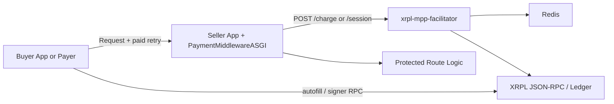

# Architecture Overview

`xrpl-mpp-stack` is a Python-first implementation of the Machine Payments
Protocol (MPP) on XRPL.

The stack keeps payment signing buyer-side, settlement logic facilitator-side,
and seller application logic inside the protected app.

## Runtime Topology

## Component Roles

| Component | Responsibility | Holds persistent state? |
| --- | --- | --- |
| Buyer app or `xrpl-mpp-payer` | Selects a challenge, signs XRPL payments, retries protected requests. | Local receipts only when using payer. |
| Seller app with `PaymentMiddlewareASGI` | Emits MPP `402` challenges, validates paid retries through the facilitator, injects receipts into the request state. | No. |
| Facilitator | Validates and settles presigned XRPL transactions, manages prepaid session state, enforces replay and freshness rules. | Redis-backed replay/session state. |
| Redis | Stores replay markers, gateway auth records, rate-limit state, and session balances. | Yes. |
| XRPL | Final settlement layer for charge payments and session top-ups. | On-ledger. |

## Package Map

| Package | Layer | Use it for |
| --- | --- | --- |
| `xrpl-mpp-core` | Shared protocol layer | Header models, codecs, asset helpers, challenge/receipt encoding. |
| `xrpl-mpp-middleware` | Seller integration layer | Route protection, challenge generation, facilitator coordination. |
| `xrpl-mpp-facilitator` | Settlement layer | `GET /supported`, `POST /charge`, `POST /session`, replay and session enforcement. |
| `xrpl-mpp-client` | Buyer SDK | HTTPX transport, signer integration, automatic charge/session retries. |
| `xrpl-mpp-payer` | Buyer runtime | CLI, proxy, receipts, spend caps, and MCP tooling. |

## Charge Intent

For `charge`, every protected request maps to one XRPL payment:

1. buyer requests a protected route
2. middleware returns `402 Payment Required` with `WWW-Authenticate: Payment`
3. buyer signs an XRPL `Payment` using the challenge `invoiceId`
4. buyer retries with `Authorization: Payment`
5. middleware forwards the credential to the facilitator
6. facilitator validates and settles the transaction
7. middleware forwards the request to the app and adds `Payment-Receipt`

See [Payment Flow](how-it-works/payment-flow.md) for the sequence diagram and
[Header Contract](how-it-works/header-contract.md) for the exact wire format.

## Session Intent

For `session`, one XRPL prepayment can cover multiple requests:

1. seller emits a `session` challenge with `sessionId`, `unitAmount`, and `minPrepayAmount`
2. buyer opens the session with a signed XRPL transaction
3. later requests reuse the facilitator-issued `sessionToken`
4. the buyer can top up or close the session explicitly

The facilitator stores session state in Redis and only submits new XRPL
transactions for `open` and `top_up`.

## Trust And State Boundaries

- The buyer keeps the XRPL seed. The facilitator never holds the buyer private key.
- The seller app does not verify XRPL transactions directly. It delegates that work to the facilitator.
- Redis holds replay markers and session balances, not customer account custody.
- In `single_token` mode, middleware authenticates to the facilitator with one shared bearer token.
- In `redis_gateways` mode, the facilitator authenticates per-gateway tokens from Redis and enforces stricter ledger-window freshness.

## Common Topologies

### Local Docker Demo

- facilitator, merchant, and Redis run under `docker compose`
- buyer runs as the demo container or a local script
- network defaults to XRPL Testnet

Start here:

- [Guided Quickstart: Testnet XRP](quickstart/testnet-xrp.md)
- [Run Demo Variants](quickstart/demo-variants.md)

### Embedded Seller App

- your FastAPI or Starlette app runs `PaymentMiddlewareASGI`
- a separate `xrpl-mpp-facilitator` service validates payments
- both sides share the MPP challenge secret and auth configuration

Next:

- [Seller Integration](integrations/seller.md)
- [Deployment Modes](configuration/deployment-modes.md)

### Buyer Integration

- application buyers use `xrpl-mpp-client`
- operators and agent tooling can use `xrpl-mpp-payer`
- both support XRP and issued assets such as RLUSD and USDC

Next:

- [Buyer Integration](integrations/buyer.md)
- [Configuration](configuration.md)
