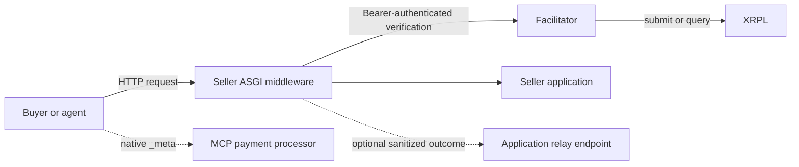

# Architecture and standards boundary

The repository is a non-custodial integration stack. The buyer controls its
wallet; the seller challenges and gates requests; the facilitator verifies or
submits XRPL evidence. Redis stores replay and channel high-water state, not
wallet secrets. Recipient claim redemption is the deliberate key-bearing
exception. Production deployments can inject a KMS/HSM-backed `RecipientSigner`;
`PAYCHANNEL_RECIPIENT_SEED` is a local-wallet adapter and must be isolated as
key-bearing infrastructure when used.

## Components

```mermaid
flowchart LR
    B[Buyer or agent] -->|HTTP request| M[Seller ASGI middleware]
    M -->|Bearer-authenticated verification| F[Facilitator]
    F -->|submit or query| X[XRPL]
    M --> A[Seller application]
    B -. native _meta .-> P[MCP payment processor]
    M -. optional sanitized outcome .-> R[Application relay endpoint]
```

| Layer | Responsibility | Standards status |
| --- | --- | --- |
| MPP HTTP authentication | Challenge, credential, preference, and receipt fields | Normative MPP core draft |
| `xrpl` charge/session payloads | XRPL payment and PaymentChannel semantics | Ripple-compatible method profile |
| OpenAPI `x-payment-info` | Preflight offers | Payment discovery draft-01 |
| MCP `_meta` transport | Paid MCP operations and payment errors | MPP MCP transport draft |
| hooks and outcome relay | Telemetry and application integration | Non-normative, opt-in |

## Charge

A seller creates one or more `xrpl` / `charge` challenges. A buyer validates the
terms and returns either:

- `{ "type": "transaction", "blob": "..." }` for facilitator submission; or
- `{ "type": "hash", "hash": "..." }` after payer-side submission.

The facilitator validates the decoded transaction or resolved hash against the
challenge: network, destination, currency, exact amount, invoice, source,
tags, memos, settlement result, and replay state. Partial payments are rejected.
Both pull and push paths require successful validated ledger settlement before
the protected application runs.

## Session with Payment Channels

The `session` intent represents an XRPL Payment Channel, not an application
balance. The buyer may submit a signed `PaymentChannelCreate` transaction for
`open`, then signed cumulative claims for `voucher`, and an optional final
claim for `close`.

The cumulative claim is the channel total, not the price of the current HTTP
request. Atomic state rejects equal, lower, conflicting, replayed, or
cross-network claims. No bearer-like session credential is created.

The facilitator may import a matching channel from validated ledger state when
the first proof is a voucher/close rather than an MPP-managed open. An
out-of-band `PaymentChannelFund` is detected through later ledger verification
and can raise the durable funding ceiling; it is not an MPP top-up action.

An MPP `close` is a final cumulative voucher. With an explicitly configured
recipient signer, the facilitator can redeem that claim on-ledger and await
validation. Recipient redemption does not set `tfClose`, delete the PayChannel,
or refund unused XRP. Without a recipient signer, the service durably finalizes
the MPP session and retains the final proof, but does not claim on-ledger closure
or settlement. Only the funder can initiate the
XRPL close/refund path, with `CancelAfter` as the time-based alternative.

An opt-in maintenance worker scans a bounded page of network-namespaced channel
records, obtains a per-channel Redis lease, and redeems an outstanding high-water
claim. It may finalize an idle MPP session after redemption, but the signed
recipient transaction is field-locked to `Flags=0`; it cannot request the
funder-only XRPL `tfClose` transition. Both explicit close and idle finalization
compare-and-set the expected cumulative amount so a concurrently newer voucher
remains active and redeemable instead of being finalized under an older claim.

## Receipt boundary

The required MPP receipt fields are:

- `status`
- `method`
- `timestamp`
- `reference`

Fields such as `challengeId`, `network`, `invoiceId`, `channelId`, `cumulative`,
`action`, `txHash`, and `settlementStatus` are XRPL method extensions. Consumers
must ignore unknown extensions and must not infer payment success from a receipt
on a failed application response.

## Unsupported profile

MPP defines an independent generic subscription intent draft. Neither the MPP
core nor that draft defines XRPL subscription settlement. Until an XRPL method
profile exists and is implemented here, subscription challenges are not
advertised or settled by this stack.
