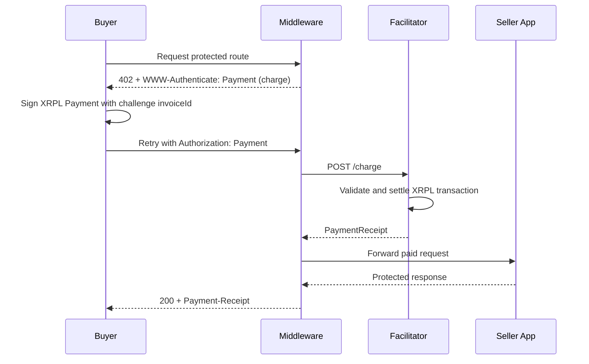
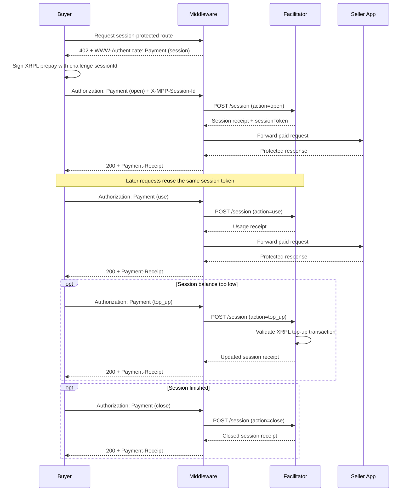

# Payment Flow

## Charge

1. A buyer requests a protected resource.
2. The middleware returns `402 Payment Required` with `WWW-Authenticate: Payment`.
3. The buyer decodes the challenge request and signs an XRPL `Payment`.
4. The buyer retries with `Authorization: Payment`.
5. The middleware forwards the credential to the facilitator.
6. The facilitator validates and settles the XRPL transaction.
7. The app receives `request.state.mpp_payment`, and the response includes `Payment-Receipt`.

## Session

1. A buyer requests a session-protected resource.
2. The middleware returns a `session` challenge.
3. The buyer opens the session with a prepaid XRPL transaction.
4. Later requests reuse the session with `action="use"`.
5. If balance runs low, the buyer sends `action="top_up"`.
6. When finished, the buyer sends `action="close"`.
