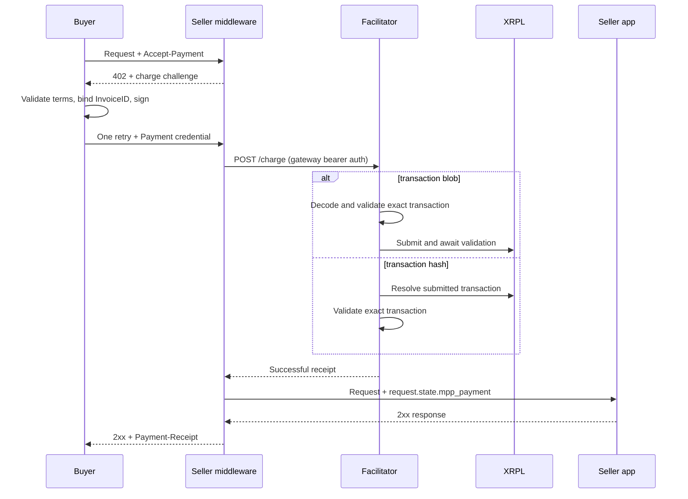
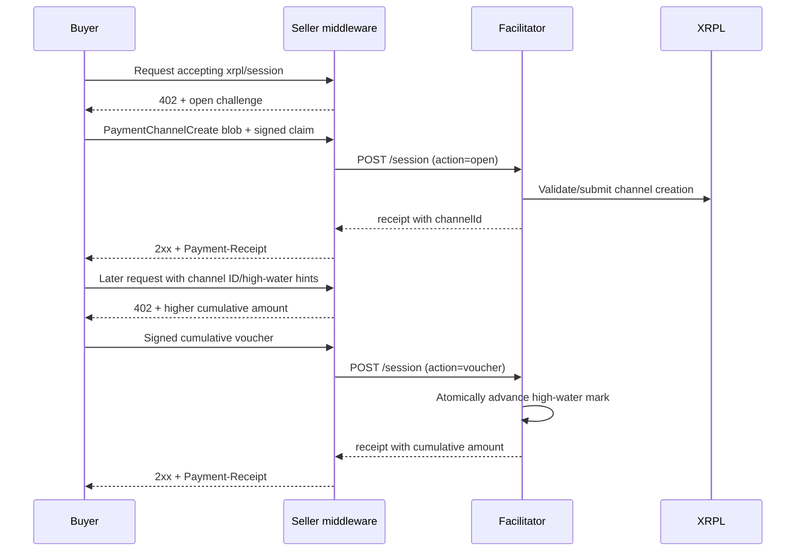

# Payment flows

## One-time charge

```mermaid
sequenceDiagram
    participant B as Buyer
    participant S as Seller middleware
    participant F as Facilitator
    participant X as XRPL
    participant A as Seller app

    B->>S: Request + Accept-Payment
    S-->>B: 402 + charge challenge
    B->>B: Validate terms, bind InvoiceID, sign
    B->>S: One retry + Payment credential
    S->>F: POST /charge (gateway bearer auth)
    alt transaction blob
        F->>F: Decode and validate exact transaction
        F->>X: Submit and await validation
    else transaction hash
        F->>X: Resolve submitted transaction
        F->>F: Validate exact transaction
    end
    F-->>S: Successful receipt
    S->>A: Request + request.state.mpp_payment
    A-->>S: 2xx response
    S-->>B: 2xx + Payment-Receipt
```

The signer uses a challenge-provided `invoiceId`, or derives a deterministic
64-hex InvoiceID from the challenge ID. The credential source is the payer's
XRPL DID. Challenge-provided destination/source tags and memos are copied into
the transaction and verified. Access is granted only for a matching successful
validated transaction; an accepted submission is not settlement.

## PaymentChannel session

```mermaid
sequenceDiagram
    participant B as Buyer
    participant S as Seller middleware
    participant F as Facilitator
    participant X as XRPL

    B->>S: Request accepting xrpl/session
    S-->>B: 402 + open challenge
    B->>S: PaymentChannelCreate blob + signed claim
    S->>F: POST /session (action=open)
    F->>X: Validate/submit channel creation
    F-->>S: receipt with channelId
    S-->>B: 2xx + Payment-Receipt
    B->>S: Later request with channel ID/high-water hints
    S-->>B: 402 + higher cumulative amount
    B->>S: Signed cumulative voucher
    S->>F: POST /session (action=voucher)
    F->>F: Atomically advance high-water mark
    F-->>S: receipt with cumulative amount
    S-->>B: 2xx + Payment-Receipt
```

The seller challenges for a cumulative channel amount. A buyer proves the new
total with an XRPL PaymentChannel claim signature. The server charges only the
delta from the accepted high-water mark and rejects non-advancing claims.

`close` is an explicit final voucher. Its receipt can record the final
`channelId`, `cumulative`, and redemption reference, but the MPP action itself
is not an XRPL channel close or refund. When the facilitator has the optional
recipient seed, it can submit the retained cumulative claim and await validated
redemption. That recipient-side `PaymentChannelClaim` does not set `tfClose`;
only the funder can initiate the on-ledger close that eventually returns unused
XRP. Without a recipient signer, the session is durably finalized while its
final voucher remains off-ledger and must be redeemed separately.

Channel creation and funding can also happen outside the MPP exchange. A
matching existing channel is imported from validated ledger state on the first
voucher/close. `PaymentChannelFund` is submitted directly to XRPL, and a later
voucher causes the facilitator to adopt the validated increased funding.

## Error boundary

- Missing payment produces `402` plus a fresh challenge.
- Malformed, expired, mismatched, replayed, or failed evidence does not reach the
  protected application.
- A facilitator verification failure is returned as a payment problem, not a
  receipt.
- If a charge hash, pull submission, or channel-open transaction may have
  reached XRPL but validation is not yet observable, the facilitator returns a
  non-cacheable `503 settlement-pending` problem with `Retry-After` and the
  locally derived transaction hash. The buyer must reconcile that hash and
  retry the same proof; it must not create a fresh payment or channel.
- If the application returns an error after verification, middleware must not
  attach `Payment-Receipt` to that error response.
